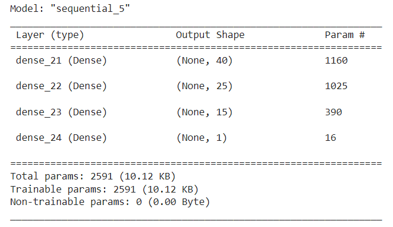

# 21_Deep_Learning_Project

##  Alphabet Soup Charity Neural Network Model Report

### Overview of the Analysis

This analysis and neural network model is the product of a request from Alphabet Soup to create a predictive tool that would be able to predict success outcomes for ventures by charities requesting funding from Alphabet Soup with at least 75% accuracy. In order to create this predictive model, Alphabet Soup provided a CSV with historical data regarding organizations the company has funded, their success outcome and a variety of other data points (see results for specific data points).  

The deliverable for this project is the network model as well as this report which analyzes the process that was conducted to create the model. After an iniital model was created, several attempts to optimize the model were attmepted, which is descirebed in more detail later in this report. 

### Results 
Results: Using bulleted lists and images to support your answers, address the following questions:

#### Data Preprocessing

During the data preprocessing stage, several steps were taken to prepare the data for training the neural network model. Reviewing the strucutre of the data provided in the CSV, the column/variable that Alphabet Soup wanted to be able to predict and would act as the target varaible for our model is the ```IS_SUCCESSFUL``` variable. This column provides a boolean (1/0) value for whether or not the venture ended up being successful. Further review identified two columns ```EIN``` and ```NAME``` that were not features, but rather identifiers and therefore they were removed from the input data. The rest of the CSV included the following 9 feature variables: 


As can be seen in the screenshot, some of the variables were already in integer format (continuous variable ```ASK_AMT``` and ```STATUS```), as well as the ```IS_SUCCESSFUL``` varialbe, which meant they would not be impacted when using our get_dummies method to prep the other categorical variables for the neural network model. Prior to getting dummy columns for all of the categorical varialbles, categories were collapsed into an "OTHER" category through a binning process for both ```APPLICATION_TYPE``` and ```CLASSIFICATION``` in order to reduce the number of categories below 10. This binning process was done at a cutoff point that seemed to group the more rare/less frequent categories into "OTHER". After binning and creating the dummy columns, the data was split into train and test datasets and a standard scalar was applied to those datasets, at which point the data was ready to be given to the neural network model. 

#### Compiling, Training, and Evaluating the Model

##### Original Model 

In the original neural network model which used all 9 features as inputs, the model had 43 input dimensions (based on the binning and dummy columns that were created). This first model had 2 hidden layers (the first layer having 30 neurons and the second layer having 20 nerurons) that both used a 'relu' activation function. Additionally, the output layer had 1 neuorn (given that the predicted result needed to be a boolean result of Successful or Not Successful), and that layer utilized a Sigmoid activation function. The model summary with parameters (1961 total) can be seen below: 


The logic behind number of neurons for this model was to decrease the number of neurons between the 1st and 2nd layer and to start at a number close to the number of dimensions, knowing that there would likely need to be optimization in the model. After training the model for 100 epochs, the resulting model had a 72.52% accuracy and .553 loss when run on the test dataset, as can be seen below: 


With an accuracy score of 72.52%, this model did not meet the target performance of 75%, so a series of optimiazations were conducted in order to attempt to improve the accuracy of the model, which will be summarized below. 

##### Optimization attempt #1 

In the first round of optimization, a few additional steps were taken in pre-processing of the data. In doing a deeper reivew of the dataset, the ```STATUS``` and ```SPECIAL_CONSIDERATION``` columns were removed due to the lack of variance in the data (both columns had 2 categories and were heavily skewed to one category), hoping that reducing the features would improve performance by reducing noise. Additionallly, the binning process for both ```APPLICATION_TYPE``` and ```CLASSIFICATION``` were adjusted to see if adjusting the granularity had any impact on the model. Once all the dummy columns were created, one column for each categorical field was then removed from the dataset because the final category can be determined when the value of all the dummy columns are 0. This removed 6 additional columns from the final dataset, also hoping to reduce the noise by lowering the total input dimensions from 43 in the original model to 34. The final changes to this first optimiazation included adding a thrid hidden layer with 10 neurons and using the 'leaky_relu' activation function for the 3 layers. The resutling model summary can be seen below (1891 total parameters): 


After training the model for 100 epochs, this first optimization still did not meet the 75% goal. The model had a minimal increase in accuracy (72.60%) and a .550 loss when run on the test dataset, as can be seen below: 


##### Optimization attempt #2

For the second round of optimization, the only adjustment made to the pre-processing data process, was to change the binning for ```CLASSIFICATION``` back to the bins in the Original model (less than 1800 categorized as 'Other'). Optimization #1 had actually increased the number of categories for that feature, which didn't align with the logic of trying minimize noise. This resulted in 31 input dimensions for this model. All other preprocessing steps matched the steps taken in Optimization #1. The only additional change for this round was increasing the number of neurons in each of the 3 hidden layers (60, 30, and 15 respectively), which resulted in the model summary below (4231 total parameters). 


After training the Optimizaition #2 model for 100 epochs, another minimal increase in accuracy was seen (72.78%), with a .555 loss when run on the test dataset (see below):


##### Optimization attempt #3

In the final attempt at optimizing the model, the number of categories in ```INCOME_AMT``` was reduced by grouping all categories with income reported over $1 Million. The rest of the pre-processing remained, which resulted in 28 input dimensions. Based on the minimal increases in prior optimizations, I decided to reduce the number of neurons slightly (40,25,15) and reduce the number of epochs from 100 to 70. In all the prior models, there was a pattern of reaching between 73%-74% accuracy during training and fluctuating up and down slightly with a very gradual increase starting around 50 epochs. For this final optimization, I wanted to see if reducing the complexity and number of epochs had a significant impact on accuracy (as we would prefer a model that is only as complex as needed and not overtrained to the training data). The summary of the model can be seen below (2591 total parameters):



Even with the less complex and less trained (70 epochs) model, the accuracy of the model against the test data was 72.69% with .556 loss, which is extremely close to the previous models and still higher than the original model(see below):


Across all the optimiization attmepts utilzing a variety of methods (adjustments in the model parameters and adjustments in the data pre-processing stage), our model was unfortunately not able to meet the 75% accuracy goal. 

### Summary

Overall, even though the model did not reach the 75% accuracy goal, 72.6% - 72.8% is not too far off the desired result. Alphabet Soup should consider how much risk they are willing to hold if they were to use any of the provided models. It is the recommendation of the author to utilize either Optimization #2 or Optimiazation #3. With the negligible differency in accuracy, Optimization #3 has less worry of over-training than Optimization #2. 

Another avenue that could be explored would be to develop a predicitive model using a more interpretable algorithim, such as a random forset model or decision-tree (or combination). Even if the deicision tree would likely not be your final model, both teh decision tree and the collction of decision trees produced from a random forest model, could provide some insight as to how the variables are interacting with one another and if there are additional variables that may be better to remove or weight more or less strongly in a final model. 

## Additional Notes
All Models (Original and 3 Optimizations) were saved and are located in this repository along with the jupyter notebooks used to create each of them. 

## Code Source

Additional resources referenced and utilzied for my project code are listed below: 

* Filtering a Series</br>
https://stackoverflow.com/questions/28272137/pandas-how-to-filter-a-series

* Saving neural network model to google drive </br>
https://medium.com/@ml_kid/how-to-save-our-model-to-google-drive-and-reuse-it-2c1028058cb2
